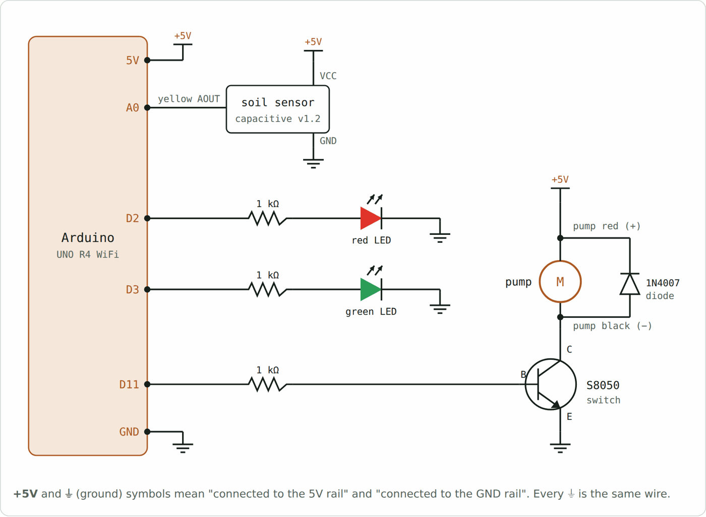
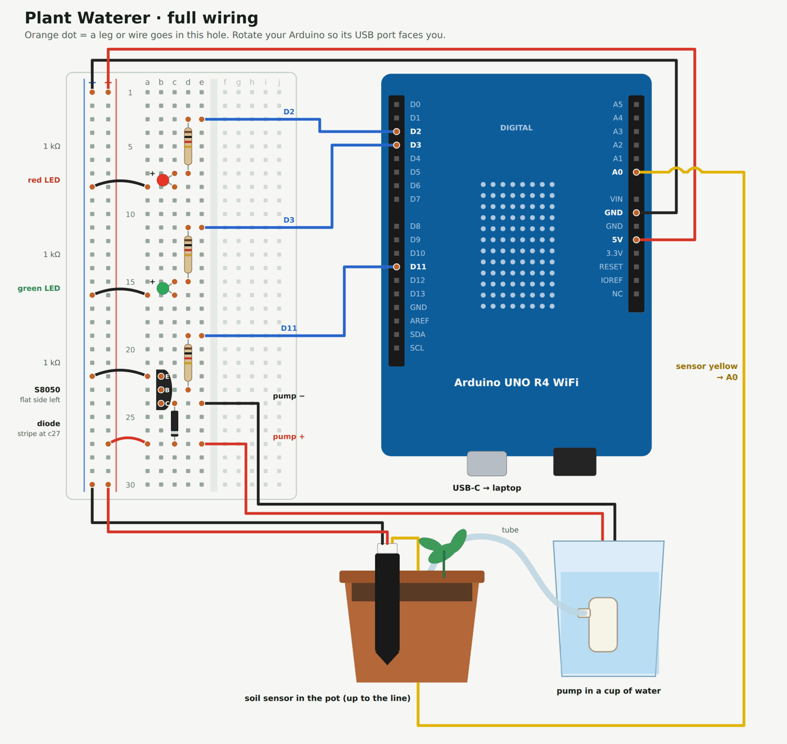

# Arduino Plant Waterer

My first hardware project: an Arduino that checks if a plant's soil is dry and waters it automatically.

It follows the basic loop every robot uses: **sense → think → act**.

- **Sense:** a capacitive soil moisture sensor measures how wet the soil is.
- **Think:** the Arduino compares that to a threshold (30 %).
- **Act:** if the soil is dry, the red LED lights and a small pump waters the plant. If it's wet, the green LED lights.

<!-- PHOTOS -->

## Parts

| Part | Qty | Job |
|---|---|---|
| Arduino UNO R4 WiFi | 1 | The brain: reads the sensor, runs the code |
| Capacitive soil moisture sensor v1.2 | 1 | Turns soil wetness into a voltage |
| Mini submersible pump (3–5 V) + tube | 1 | Moves water from a container to the pot |
| S8050 NPN transistor | 1 | Electronic switch: lets a pin control the pump's bigger current |
| 1N4007 diode | 1 | Absorbs the voltage spike when the pump switches off |
| Red LED + green LED | 1 each | Show the decision: dry / wet |
| 1 kΩ resistor | 3 | Limit current into the LEDs and the transistor |
| Full-size breadboard + jumper wires | – | Connections without soldering |
| USB-C cable | 1 | Power and code upload |

## Schematic

| Arduino pin | Connects to |
|---|---|
| 5V / GND | Breadboard + / − rails |
| A0 | Sensor signal (yellow) |
| D2 | 1 kΩ → red LED → GND |
| D3 | 1 kΩ → green LED → GND |
| D11 | 1 kΩ → transistor base. Pump sits between +5V and the transistor collector; emitter to GND |

## Breadboard wiring

## How it works

1. **Sensor loop:** 5V → sensor → GND. Its yellow wire sends a voltage to A0 (lower = wetter).
2. **LED loops:** D2 or D3 goes HIGH → current flows through a 1 kΩ resistor and the LED to GND.
3. **Pump loop:** a pin can only give ~8 mA but the pump needs ~150 mA. So D11 sends a tiny current into the transistor, which closes the pump's own loop from the 5V rail.
4. **Diode:** when the pump stops, its motor kicks back a voltage spike. The diode gives it a safe path so it doesn't damage the transistor.

## Run it

1. Open `plant_waterer/plant_waterer.ino` in the Arduino IDE and upload it to an UNO R4 WiFi.
2. On power-up there's a self-test: red, green, then the pump for 1 second.
3. `DEMO_MODE = true` uses fake soil data that dries out, so you can watch the full cycle.
4. For real use, set `DEMO_MODE = false` and calibrate:
   - note the A0 reading with the sensor in **air** → `DRY_READING`
   - note the reading with the sensor in **water** → `WET_READING`

## What broke and how I fixed it

- **Rails mixed up.** My board's + rail was on the inside and − on the outside, unlike the diagram I followed. Lesson: go by the red/blue lines printed on the board.
- **Sensor powered backwards** (red and black swapped) → readings stuck near 1023.
- **Long sensor wire made of many joined jumpers** → one loose joint cut the power. Fewer joints = fewer failure points.
- **Transistor not pushed fully into the breadboard** → the pump never ran, even though the code was right. Pressing it down fixed everything.

Most bugs were physical, not code. A multimeter found every one of them.

## What I'd do next

- Calibrate with real soil and run it on a real plant.
- Show moisture on the 16×2 LCD.
- Send moisture readings to my phone using the R4's WiFi.

## License

MIT
